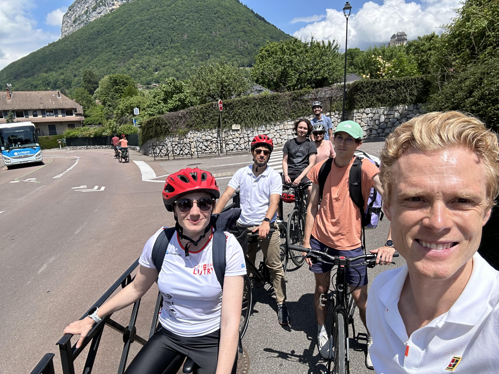
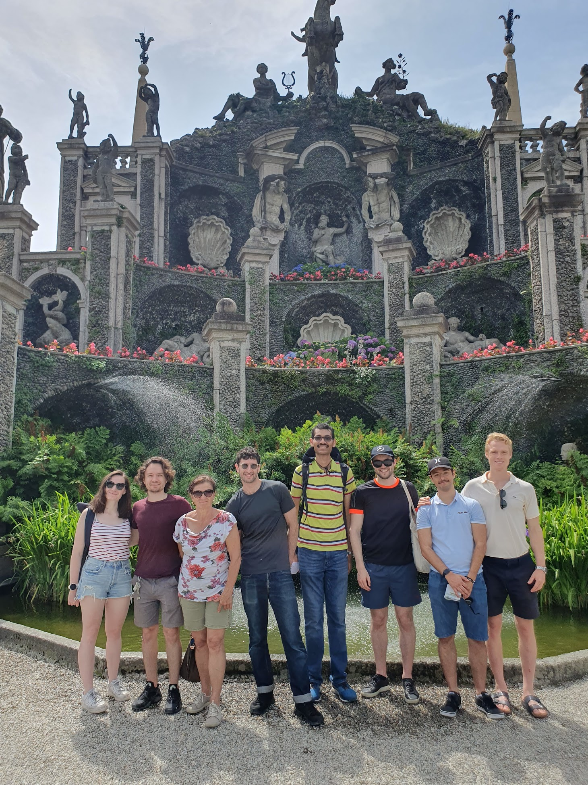

Current PhD students: Amit Sawant (Msc, University of Michigan), Lorenzo Gasparollo (Bsc and Msc, Padova University), Julien Laurendeau (BSc EPFL, MSc ETH), Gellert Perenyi (MSc ETH)

Previous PhD student: Matias Janvin (Bsc and Msc, Oxford University), successfully defended his thesis in November 2023

Postdoctoral Research Fellows: Elise Dumas (PhD, Institut Curie operated by Université Paris-Sud, starting September 1st 2023)

Previous Research Fellows: Aaron Sarvet (Assistant Professor, University of Massachusetts Amherst), Pal Ryalen (Senior Scientist, University of Oslo), Anders Huitfeldt (MD, Oslo University Hospital) 

Secretary: [Carole Weissenberger](https://people.epfl.ch/carole.weissenberger) 

From left (2024): Elise Dumas, Julien Laurendeau, Lorenzo Gasparollo Carole Weissenberger, Amit Sawant, Gellert Perenyi and me

From left (2023): Elise Dumas, Lorenzo Gasparollo, Carole Weissenberger, Aaron Sarvet,  Amit Sawant, Matias Janvin, Julien Laurendeau and me

From left (2022): Aaron Sarvet, Anders Huitfeldt, Matias Janvin, Carole Weissenberger, Amit Sawant, Lorenzo Gasparollo and me

From left (2021): me, Pål Ryalen, Matias Janvin, Carole Weissenberger, Aaron Sarvet and Amit Sawant.

From left (2020): me, Pål Ryalen, Matias Janvin and Carole Weissenberger.
