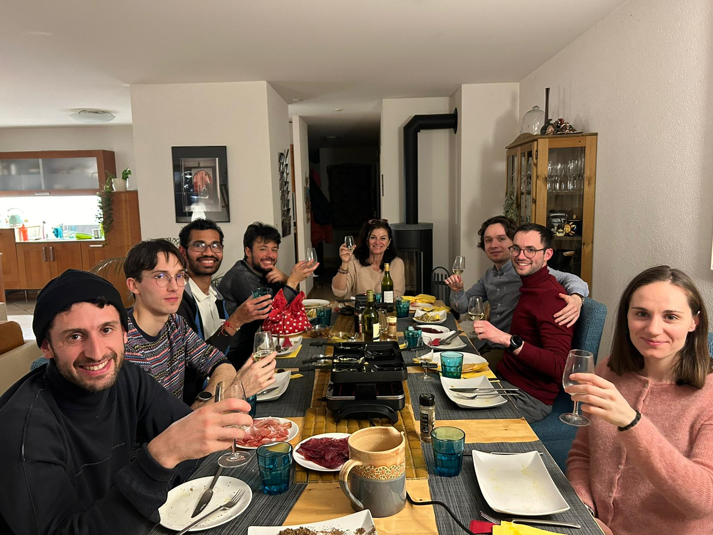
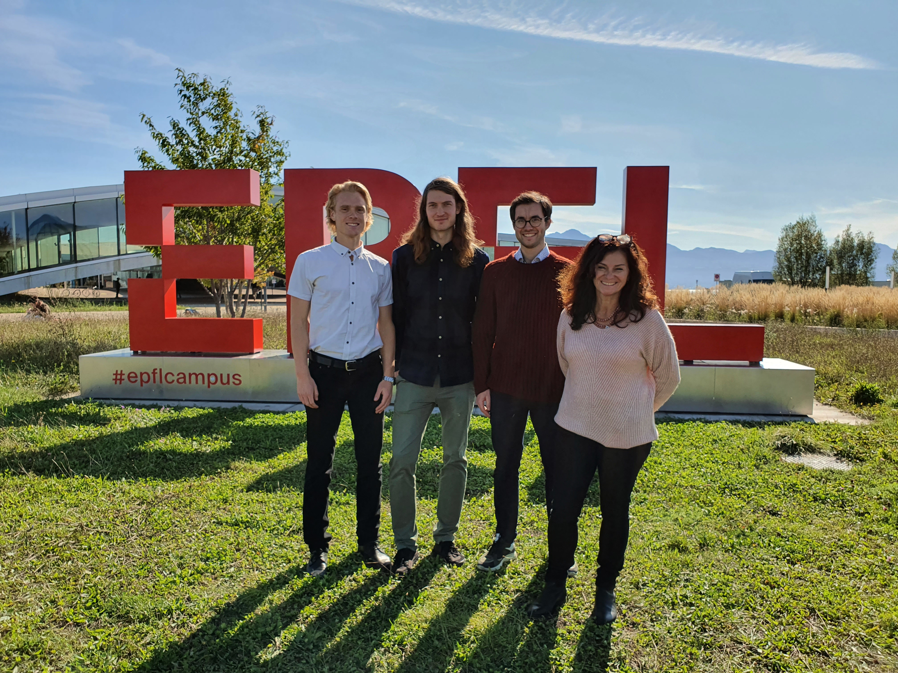

Secretary: [Carole Weissenberger](https://people.epfl.ch/carole.weissenberger) 

Current PhD students: Amit Sawant (Msc, University of Michigan), Lorenzo Gasparollo (Bsc and Msc, Padova University), Julien Laurendeau (Bsc EPFL, Msc ETH), Gellert Perenyi (Msc ETH), Ignacio Gonzalez Perez (Msc ETH)

Previous PhD student: Matias Janvin (Bsc and Msc, Oxford University), successfully defended his thesis in November 2023

Postdoctoral Research Fellows: Elise Dumas (PhD, Institut Curie operated by Université Paris-Sud), Tobias Freidling (PhD, University of Cambridge, UK),

Previous Research Fellows: Aaron Sarvet (Assistant Professor, University of Massachusetts Amherst), Pal Ryalen (Senior Scientist, University of Oslo), Anders Huitfeldt (MD, Oslo University Hospital) 

From left (2024): Aaron Sarvet, Gellert Perenyi, Amit Sawant,  Julien Laurendeau, Carole Weissenberger, Lorenzo Gasparollo, Matias Janvin and Elise Dumas

From left (2023): Elise Dumas, Lorenzo Gasparollo, Carole Weissenberger, Aaron Sarvet,  Amit Sawant, Matias Janvin, Julien Laurendeau and me

From left (2022): Aaron Sarvet, Anders Huitfeldt, Matias Janvin, Carole Weissenberger, Amit Sawant, Lorenzo Gasparollo and me

From left (2021): me, Pål Ryalen, Matias Janvin, Carole Weissenberger, Aaron Sarvet and Amit Sawant.

From left (2020): me, Pål Ryalen, Matias Janvin and Carole Weissenberger.
