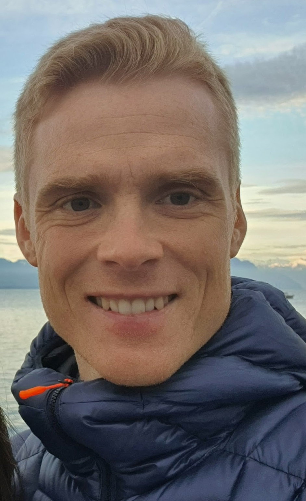

---
---
<meta name="google-site-verification" content="2mvUxfkobP5t2N6E9uEXcrff30k5lBEEbT2svuUXoPE" />

<link rel="stylesheet" href="styles.css" type="text/css">

Welcome to my website.

I am an [associate professor](https://people.epfl.ch/mats.stensrud/?lang=en) [at the Institute of Mathematics](https://www.epfl.ch/schools/sb/research/math/), [EPFL](https://www.epfl.ch/schools/sb/research/math/research/statistics/). From January 1st 2025 I am also the director of the doctoral program in mathematics (EDMA) at EPFL. My research focuses on methods for causal inference. I am particularly interested in settings with exposures and outcomes that depend on time, that is, longitudinal data. Many of my works are inspired by applications in clinical medicine and epidemiology. 

Before I came to EPFL, I was privileged to work with [Miguel Hernán](https://www.hsph.harvard.edu/miguel-hernan/), [Jamie Robins](https://en.wikipedia.org/wiki/James_Robins) and other excellent researchers at [Harvard School of Public Health](https://www.hsph.harvard.edu/) as a Kolokotrones Research Fellow and Fulbright Research Scholar. I also had the pleasure of being a part-time postdoctoral researcher under supervision of [Kjetil Røysland](https://www.med.uio.no/imb/english/people/aca/roysland/) and [Odd Aalen](https://www.med.uio.no/imb/english/people/aca/oaalen/) at the [University of Oslo](/https://www.uio.no/english/). Before I became a full time academic, I had a short career as resident doctor in internal medicine. 

I received my MD, Dr.Philos in Neuroscience and BSc in Mathematics from the [University of Oslo](/https://www.uio.no/english/). I also hold a Msc in Statistics from the [University of Oxford](http://www.ox.ac.uk/).

My CV is available [here](CV_Stensrud.pdf).

I regularly have openings for **postdocs with expertise in statistics and causal inference**. If you are interested, don't hesitate to contact me by [email](contact.html). In particular, now I would like to hire a postdoc in causal inference from September 1st 2025.

