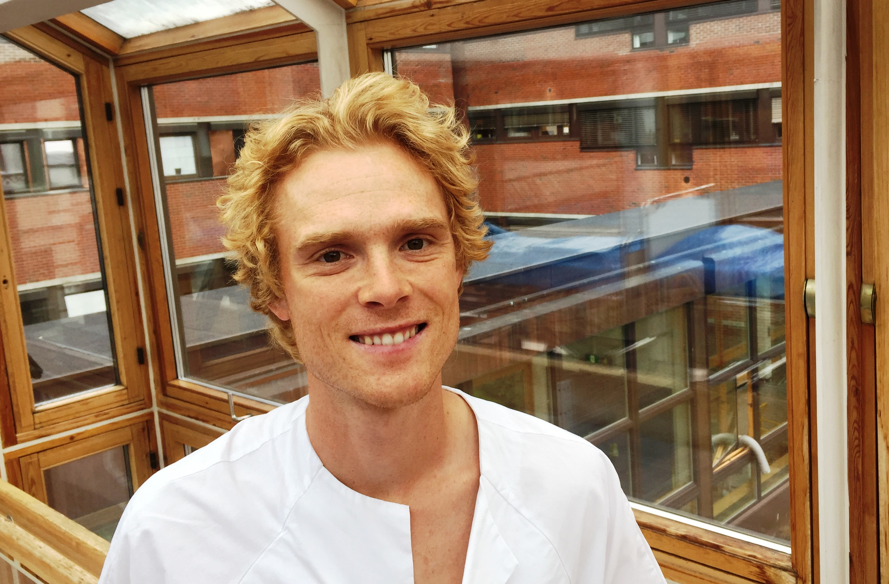

---
---
<meta name="google-site-verification" content="2mvUxfkobP5t2N6E9uEXcrff30k5lBEEbT2svuUXoPE" />

<link rel="stylesheet" href="styles.css" type="text/css">

I am a causal inference enthusiast. My research focuses on methods for causal inference in medicine. I am particularly interested in settings with exposures and outcomes that depend on time, that is, longitudinal data. 

I am privileged to work with [Miguel Hernán](https://www.hsph.harvard.edu/miguel-hernan/) and other excellent researchers at [Harvard School of Public Health](https://www.hsph.harvard.edu/) as a Kolokotrones research fellow. Before I came to Harvard as a Fulbright Research Scholar in 2018, I worked as a resident in internal medicine, and I also had the pleasure of being a part-time postdoctoral researcher under supervision of [Kjetil Røysland](https://www.med.uio.no/imb/english/people/aca/roysland/) and [Odd Aalen](https://www.med.uio.no/imb/english/people/aca/oaalen/) at the [University of Oslo](/https://www.uio.no/english/).

I received my MD, Dr.Philos in Neuroscience and BSc in Mathematics from the [University of Oslo](/https://www.uio.no/english/). I also hold a Msc in Statistics from the [University of Oxford](http://www.ox.ac.uk/).

In the fall, I will **join the Department of Mathematics at [EPFL](https://www.epfl.ch/schools/sb/research/math/research/statistics/) as tenure-track assistant professor in statistics**. I am very excited, and please reach out if you'd be interested in working with me.

My CV is available [here](CV_Stensrud.pdf).

Don't hesitate to contact me by [email](contact.html).